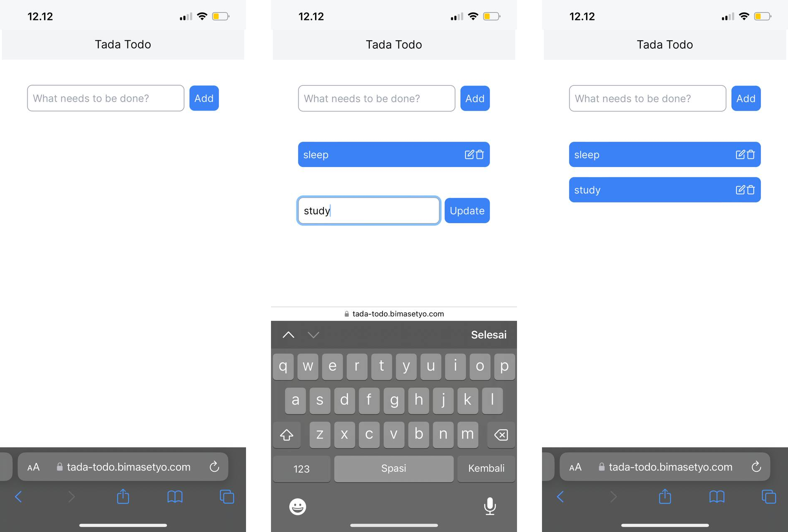

# Tada Todo

Tada Todo is a web application built using React, NextJS, and Tailwind CSS.



## Installation

To run the Tada Todo project on your local machine, follow these steps:

1. Ensure you have [Node.js](https://nodejs.org) installed on your system.
2. Clone the repository:

   ```bash
   git clone https://github.com/bima0302/tada-todo.git
   ```

3. Navigate to the project directory:

   ```bash
   cd tada-todo
   ```

4. Install the dependencies:

   ```bash
   npm install
   ```

5. Start the development server:

   ```bash
   npm run dev
   ```

6. Open your browser and visit `http://localhost:3000` to see the application.

## Project Structure

The project structure is organized as follows:

```
tada-todo/
  ├── public/                  # Static assets
  └── src/                     # Application source code
      └── app/                 # Assets
          └───components/      # Reusable React components
```

## Configuration

The project uses Next.js for server-side rendering and optimized development. The configuration can be found in the next.config.js file, where you can modify the build options, plugins, and other settings according to your requirements.

## Dependencies

The main dependencies used in this project are:

- React: A JavaScript library for building user interfaces.
- Tailwind CSS: A utility-first CSS framework for rapidly building custom user interfaces.
- Next.js: A React framework for building server-side rendered and statically generated applications.

For a complete list of dependencies, refer to the `package.json` file.

## Contact

For any questions or inquiries, you can reach out to the project maintainer:

- Name: Bima Setyo
- Email: bima030201@gmail.com
- GitHub: [bima0302](https://github.com/bima0302)

We hope you enjoy using Tada Todo!
